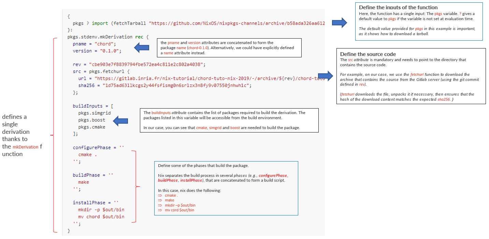

Advance Practice
=====

This page records some advanced concepts and commands for **nix**

In Nix, packages are defined in a domain specific language called **Nix Expression Language** (`details <https://nixos.org/manual/nix/stable/expressions/expression-language.html>`_)

.. note::

   - **Nix derivation**: A derivation in Nix is a definition of a build, which takes some inputs and produces an output (in other words, the derivation is a function that describes a build process). 
     Using Derivation is an alternative of using a channel, and is much more reproducible as the tarball can be fixed to a specific version as it is done here. 

Understand the nix derivation
------
The core  for a derivation is the derivation script, an example can be accessed here

There are at least two major components in a nix build script:

- Input (e.g., channel for getting building tools)
- Build process
    - name of the package
    - where to get the package
    - building tools needed
    - build phases defination

The description for the major components in a ``.nix`` build script is described below

The file can be obtained `here <https://nix-tutorial.gitlabpages.inria.fr/nix-tutorial/first-package.html#id1>`_

