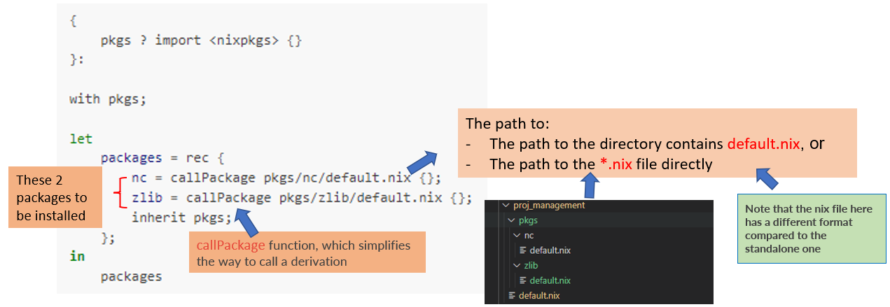
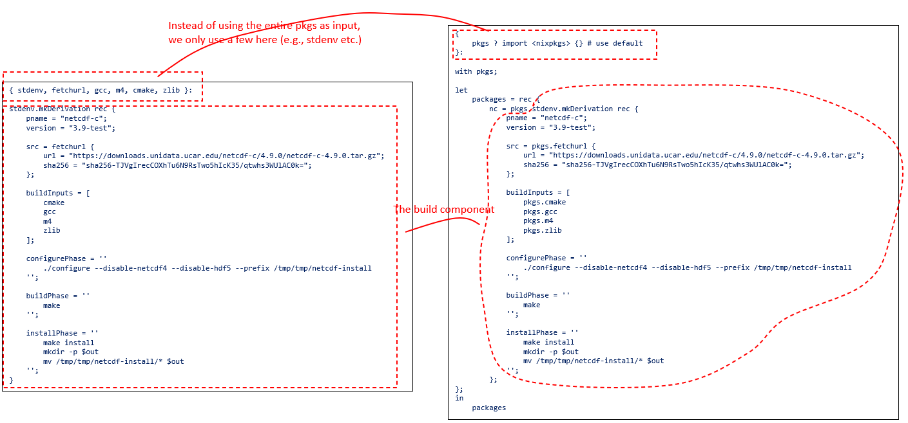

Project managment
=====

It is relatively simple to come up a derivation for a single package, however if we have many packages/environments to be managed within
a project, the number of ``.nix`` files can make the proecss pretty messy.

Luciky **nix** provides a way to manage such a large project better

.. note::

    Nix enables decentralized package definitions, as the packages do not need 
    to be in the same repository to be well defined.

In this example, we want to install ``netCDF`` and ``zlib`` through the following ``default.nix``

    .. code-block:: bash

        {
            pkgs ? import <nixpkgs> {}
        }:

        with pkgs;

        let
            packages = rec {
                zlib = callPackage pkgs/zlib/default.nix {};
                nc = callPackage pkgs/nc/default.nix {};
                inherit pkgs;
            };
        in
            packages

The above project ``default.nix`` file can be explained as below

As mentioned here, the format of the ``*.nix`` in the subdirectory for a project is different from the standalone one, 
here we give an example for the difference for ``netCDF``:

