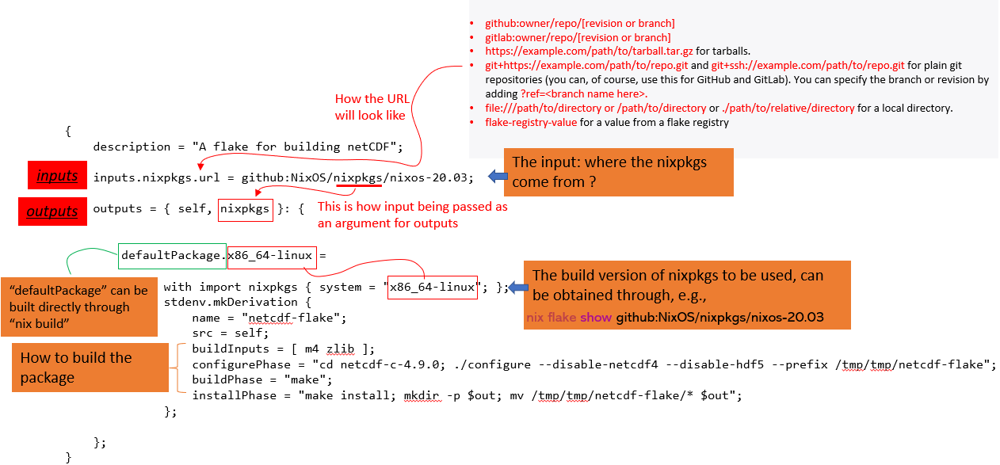

Nix Flakes
=============

Nix claims the reproducibility, but actually it is usually not the case:
- Nix can access arbitrary control files from different machines, for example,
    - ``~/.config/nixpkgs/config.nix``
    - Nix search path such as ``NIX_PATH``
    - Also, when we use `GitFetch` etc. to get the 3rd party libarary, it's difficult to absolutely make sure that the versions we get 
are the same from different builds.

Flakes are a solution to these problems. 

A flake is simply a source tree (such as a Git repository) containing a file named flake.nix, which provides a 
standardized interface to Nix packages (therefore, in most cases, the flake works with Git).

What is Nix Flake
***********

Flakes are self-contained units that have:

- inputs: dependencies
- outputs (packages, deployment instructions, Nix functions for use in other flakes). 

Flakes have great reproducibility because they are only allowed to depend on their inputs and they pin the exact versions of said inputs in a lockfile.

Create your first flake
***********
Here we provide an example about how to use ``flake`` to build ``netCDF``:

**Step 1: create an empty git repository**

First we need to create an empty git environment:

.. code-block:: bash

    git init netcdf-flake
    wget https://downloads.unidata.ucar.edu/netcdf-c/4.9.0/netcdf-c-4.9.0.tar.gz
    tar -zxvf netcdf-c-4.9.0.tar.gz
    git add netcdf-c-4.9.0

**Step 2: create flake.nix**

The command ``nix flake init`` creates a basic ``flake.nix`` for you. For example, we should go to the project root directory, and run

.. code-block:: bash

   nix flake init

Alternatively, we can create our own ``flake.nix``. An example is given below:

.. code-block:: bash

    {
        description = "A flake for building netCDF";

        inputs.nixpkgs.url = github:NixOS/nixpkgs/nixos-20.03;
        inputs.m4.url = "github:divnix/std";

        outputs = { self, nixpkgs }: {

            defaultPackage.x86_64-linux =
            # Notice the reference to nixpkgs here.
            with import nixpkgs { system = "x86_64-linux"; };
            stdenv.mkDerivation {
                name = "netcdf-flake";
                src = self;
                buildInputs = [ m4 zlib ];
                configurePhase = "cd netcdf-c-4.9.0; ./configure --disable-netcdf4 --disable-hdf5 --prefix /tmp/tmp/netcdf-flake";
                buildPhase = "make";
                installPhase = "make install; mkdir -p $out; mv /tmp/tmp/netcdf-flake/* $out";
            };

        };
    }

The above file can be explained as:

An good example of the ``flake.nix`` can be found https://github.com/haskell/haskell-language-server/blob/master/flake.nix

Note that any file that is not tracked by Git is invisible during Nix evaluation, therefore we need to make ``flake.nix`` visible to Git:

.. code-block:: bash

    git add flake.nix

**Step 3: build the package**

There are a few methods to build the package:

- build the package automatically:

    - We can build the package automatically by running 
    
    .. code-block:: bash

        ``nix build``
    
    within the directory where we have ``flake.nix``

- build the package step by step (e.g., debug):

    - For example, we can debug the different phases of the ``flake.nix`` file, if we want to debug `configurePhase`, we can do:

    .. code-block:: bash

        nix develop
        eval $configurePhase

